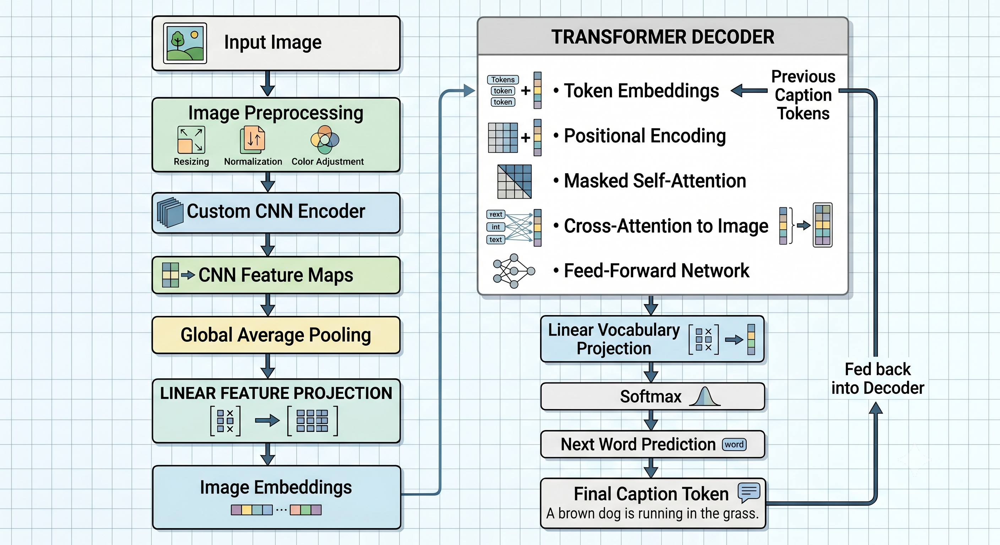

# NeuralVision: Automated Image Captioning Pipeline 📸🤖

[](https://www.python.org/downloads/)
[](https://pytorch.org/)
[](https://gradio.app/)
[](https://opensource.org/licenses/MIT)

## 📌 Executive Summary
**NeuralVision** is a robust, end-to-end computer vision and natural language processing pipeline designed to synthesize descriptive textual narratives from visual inputs. Utilizing a deep-seated **Encoder-Decoder architecture**, the system integrates a pre-trained **ResNet-50** convolutional neural network with a **Long Short-Term Memory (LSTM)** recurrent network to achieve state-of-the-art captioning capabilities on the Flickr8k benchmark.

---

## 🏗️ Technical Architecture



### 1. Visual Feature Encoding (Encoder)
The visual processing sub-system employs a **ResNet-50** backbone, pre-trained on the ImageNet dataset, to extract high-level semantic features.
*   **Feature Extraction**: Removal of the final fully-connected classification layer retains the global average pooling output (2048 dimensions).
*   **Latent Space Projection**: A bottleneck linear layer reduces dimensionality to a 256-dim embedding space, optimizing visual information for linguistic processing.
*   **Regularization**: Integrated ReLU activation and a 50% Dropout rate ensure robust feature representation and mitigate overfitting during the fusion phase.

### 2. Sequential Language Generation (Decoder)
The linguistic generation sub-system utilizes an **LSTM** architecture to model the conditional probability of word sequences.
*   **Recurrent Modeling**: A single-layer LSTM with 512 hidden units processes the sequence autoregressively.
*   **Dual-Phase Input**: 
    1.  **Context Injection**: The initial state is conditioned on the visual features extracted by the encoder.
    2.  **Sequential Decoding**: Subsequent time steps utilize learned word embeddings from the target vocabulary.
*   **Decoding Strategy**: Implementation utilizes **Greedy Search** for token selection, with logical hooks for future **Beam Search** integration.

### 3. Data Processing & Tokenization
*   **Normalized Tokenization**: Low-level text parsing involving case-folding, alphanumeric filtering, and sequence padding.
*   **Vocabulary Management**: Frequency-based vocabulary construction (thresholded at min-freq 2) to ensure a high-signal-to-noise ratio in output generation.
*   **Special Token Handling**: Explicit management of `<START>`, `<END>`, `<PAD>`, and `<UNK>` tokens for sequence delimitation and error handling.

---

## 📊 Dataset & Methodology

### Dataset: Flickr8k
*   **Composition**: 8,000 high-resolution images across diverse categories.
*   **Ground Truth**: 40,000 human-annotated captions (5 per image).
*   **Cleaning Protocol**: Automated verification of filesystem integrity to prune malformed records and missing image pointers, ensuring deterministic training batches.

### Training Pipeline
*   **Optimization**: Adam optimizer with a learning rate of $3 \times 10^{-4}$.
*   **Loss Function**: Cross-Entropy Loss with padding mask ignore-indices.
*   **Augmentation Strategy**: Dynamic resizing to 256x256 followed by 224x224 random crops to enhance spatial invariant learning.

---

## 🚀 Performance Benchmarks
The model was evaluated on a dedicated 1,000-image test set using the Bilingual Evaluation Understudy (BLEU) metric.

| Metric | Score | Metric Description |
| :--- | :--- | :--- |
| **BLEU-1** | **0.5138** | Individual word precision (Uni-gram) |
| **BLEU-2** | **0.3305** | Local phrase structure (Bi-gram) |
| **BLEU-3** | **0.2067** | Short-range sequence coherence (Tri-gram) |
| **BLEU-4** | **0.1294** | Global sentence structure (Quad-gram) |

### Training Hardware
*   **GPU**: NVIDIA GeForce RTX 3050 (4GB VRAM)
*   **Duration**: ~5 Epochs to Convergence.

---

## 🛠️ Deployment & Execution

### 1. Environment Configuration
```bash
# Create and activate virtual environment
python -m venv myenv
source myenv/Scripts/activate  # Windows: .\myenv\Scripts\activate

# Install production dependencies
pip install -r requirements.txt
```

### 2. Operational Modes
*   **Interactive Web UI (Gradio)**:
    ```bash
    python app.py
    ```
*   **Model Training**:
    ```bash
    python training/train.py
    ```
*   **Metric Evaluation**:
    ```bash
    python evaluate.py
    ```

---

## 📂 Repository Structure
```text
image-captioning/
├── app.py                # Gradio Web Interface
├── image_captioning.ipynb # End-to-end Notebook Walkthrough
├── evaluate.py           # BLEU Metric Suite
├── dataset/
│   └── flickr8k_handler.py # Data I/O & Validation Logic
├── models/
│   ├── encoder/encoder.py  # ResNet-50 Implementation
│   ├── decoder/decoder.py  # LSTM Recurrent Unit
│   └── fusion/model.py     # Inference Logic & Wrapper
├── tokenizer/tokenizer.py   # Text Normalization & Vocab Build
└── training/train.py     # Training Orchestration
```

---

## 🔮 Future Roadmap
*   **Attention Mechanism**: Implement Bahdanau/Luong Attention to allow the decoder to focus on specific image regions.
*   **Beam Search**: Enhance decoding strategy to maintain multiple hypotheses for higher-quality captions.
*   **Advanced Backbones**: Migration to Vision Transformers (ViT) for superior feature extraction.

## 📝 License
Distributed under the **MIT License**. See `LICENSE` for more information.
